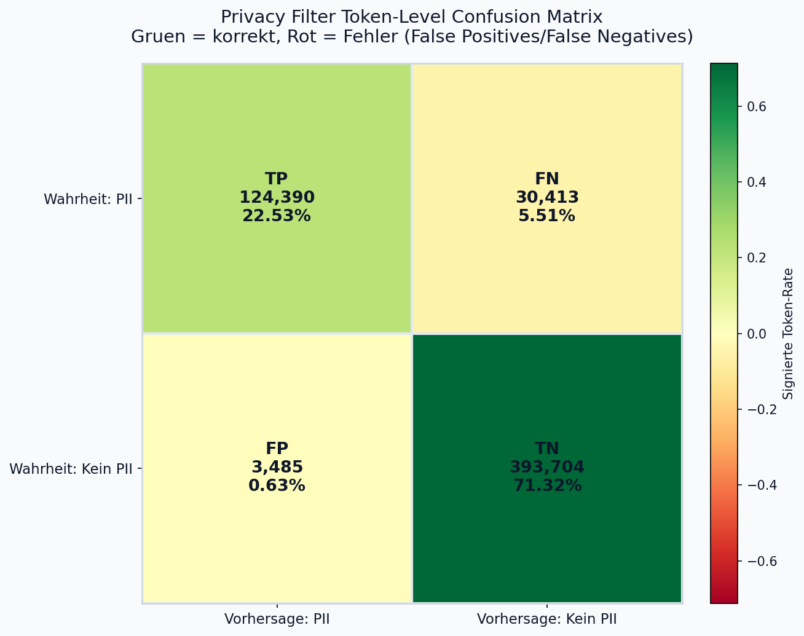
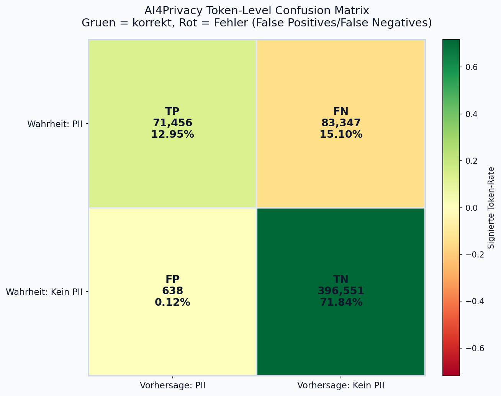
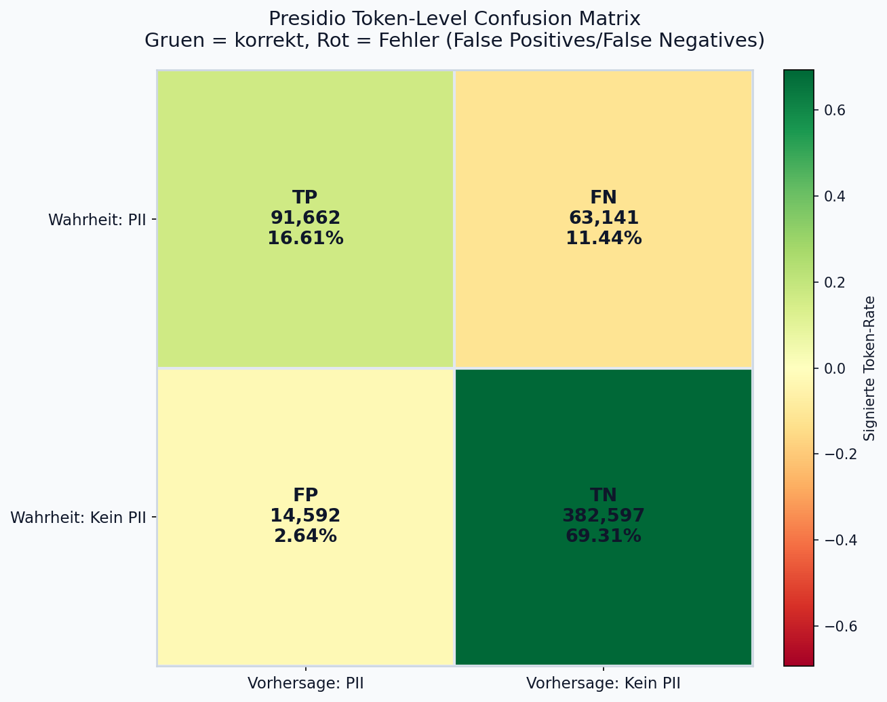

# PII Detection Benchmark

Kompakter Benchmark zur PII-Erkennung auf `ai4privacy/open-pii-masking-500k-ai4privacy`.

Im Fokus steht der Vergleich von zwei bidirektionalen Encoder-basierten Transformer-Ansaetzen:
- `openai/privacy-filter` (direkte Token-Klassifikation)
- Presidio-Pipeline (NLP-Encoder + regelbasierte Recognizer/Filter und Thresholding)
- `ai4privacy/llama-ai4privacy-multilingual-categorical-anonymiser-openpii`

## Aktueller Snapshot (de / validation)
- Dataset: `ai4privacy/open-pii-masking-500k-ai4privacy`
- Split: `validation`
- Language Filter: `de`
- Samples: `16485`

| Modell | Precision (Token) | Recall (Token) | F1 (Token) | F1 (Span) |
|---|---:|---:|---:|---:|
| `openai/privacy-filter` | 97.27% | 80.35% | 88.01% | 20.68% |
| `ai4privacy/llama-ai4privacy-multilingual-categorical-anonymiser-openpii` | 99.12% | 46.16% | 62.99% | 5.21% |
| `Presidio` | 86.27% | 59.21% | 70.22% | 41.56% |

## Plots
Privacy-Filter:


AI4Privacy:


Presidio:


## Was wird gemessen?
- Token Precision - Präzision der identifizierten sensiblen Tokens
- Token Recall - Genauigkeit, Trefferquote von sensiblen Tokens
- Token F1 - Maß für die Vorhersageleistung. Er wird aus Präzision und Trefferquote des Tests berechnet. 
- F1 (spans) - korrekt zusammenhängende Tokens insgesamt korrekt klassifiziert

## Setup (kurz)
```powershell
py -3.12 -m venv .venv
.\.venv\Scripts\activate
python -m pip install --upgrade pip
python -m pip install -r requirements.txt
```

Optional GPU (RTX 4070 Ti / CUDA 12.4):
```powershell
python -m pip install torch torchvision torchaudio --index-url https://download.pytorch.org/whl/cu124
python -c "import torch; print(torch.__version__); print(torch.version.cuda); print(torch.cuda.is_available())"
```

## Benchmark ausfuehren
Privacy-Filter (alle `de` Samples, inkl. Report + Plot):
```powershell
python .\benchmark_privacy-filter.py --dataset ai4privacy/open-pii-masking-500k-ai4privacy --split validation --filter-language de --max-samples 0 --output-path .\results_privacy_filter_de_all.txt --plot-path .\confusion_privacy_filter_de_all.png
```

Presidio (alle `de` Samples, inkl. Report + Plot):
```powershell
python .\benchmark_presidio.py --dataset ai4privacy/open-pii-masking-500k-ai4privacy --split validation --filter-language de --max-samples 0 --output-path .\results_privacy_filter_de_all_presidio.txt --plot-path .\confusion_privacy_filter_de_all_presidio.png
```

AI4Privacy-Modell (alle `de` Samples, inkl. Report + Plot):
```powershell
python .\benchmark_ai4privacy.py --dataset ai4privacy/open-pii-masking-500k-ai4privacy --split validation --filter-language de --max-samples 0 --output-path .\results_privacy_filter_de_all_ai4privacy.txt --plot-path .\confusion_privacy_filter_de_all_ai4privacy.png
```

Datensatz-Verteilung (Token gesamt / PII-Token, `de`, validation):
```powershell
python .\dataset_pii_distribution.py --dataset ai4privacy/open-pii-masking-500k-ai4privacy --split validation --filter-language de --max-samples 0 --output-path .\dataset_pii_distribution_de_validation.txt --plot-path .\dataset_pii_distribution_de_validation.png
```

Interpretierte Gesamtauswertung aus allen Result-Dateien:
```powershell
python .\evaluate_results.py --inputs .\results_privacy_filter_de_all.txt .\results_privacy_filter_de_all_ai4privacy.txt .\results_privacy_filter_de_all_presidio.txt --output-path .\evaluation_results_interpreted.txt
```
